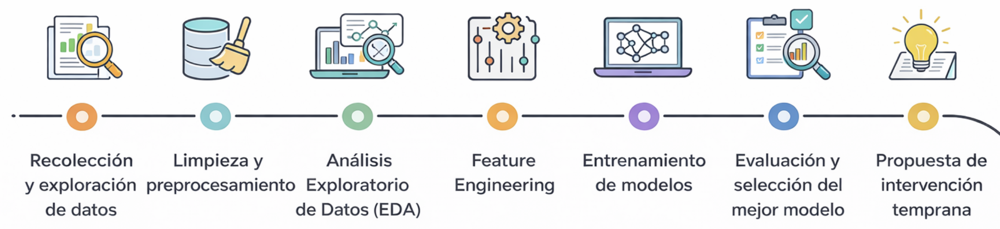
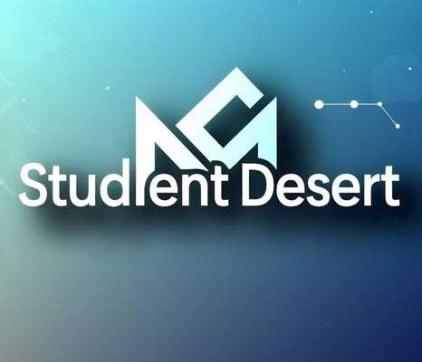

  

---

<h3 align="center">Predicción de deserción estudiantil universitaria</h3>
<h4 align="center">Machine Learning aplicado a un problema social real</h4>

## Descripción del Proyecto

La **deserción estudiantil universitaria** es uno de los principales desafíos en América Latina, especialmente en ciudades como **Bogotá**.  
Este proyecto tiene como objetivo **predecir qué estudiantes presentan mayor riesgo de abandonar sus estudios**, permitiendo a las universidades **intervenir de forma temprana**.

 **Objetivo:**  
Construir un modelo de *Machine Learning* que estime la probabilidad de deserción estudiantil utilizando variables académicas, socioeconómicas y de comportamiento.

 

## Variables Utilizadas

- Asistencia a clases
- Notas academicas
- Nivel socioeconómico
- Edad
- Carrera universitaria
- Uso de plataformas virtuales

##  Metodología del Proyecto
El desarrollo del proyecto sigue un enfoque estándar de **Ciencia de Datos**:

  

## Modelos de Machine Learning Utilizados

Se entrenaron y compararon los siguientes modelos:

- **Regresión Logística** (modelo baseline)
- **Random Forest**
- **XGBoost**
> [!NOTE]
> Los modelos fueron evaluados priorizando **Recall**, dado que es más importante detectar estudiantes en riesgo que minimizar falsos positivos.

##  Resultados del Modelo

| Modelo              | Accuracy | Recall | F1-score |
|---------------------|----------|--------|----------|
| Regresión Logística | 0.72     | 0.68   | 0.70     |
| Random Forest       | 0.81     | 0.79   | 0.80     |
| XGBoost             | **0.84** | **0.83** | **0.83** |

## Impacto Social y Consideraciones Éticas

Este proyecto tiene como fin **apoyar decisiones académicas**, no penalizar estudiantes.

- Los resultados deben usarse como **herramienta de apoyo**, no como veredicto final
- Se debe garantizar la **protección de datos personales**
- El modelo busca promover **equidad e inclusión educativa**

## Posibles Soluciones

A partir del análisis de datos y las predicciones generadas por el modelo de machine learning, se pueden implementar diferentes estrategias enfocadas en reducir la deserción estudiantil.

### Apoyo Académico Personalizado
Implementar tutorías dirigidas a estudiantes con bajo rendimiento académico.

- Refuerzo en materias críticas  
- Seguimiento continuo del progreso  
- Planes de estudio personalizados  

### Acompañamiento Psicológico
Brindar apoyo emocional a estudiantes con señales de estrés, ansiedad o desmotivación.

- Sesiones con psicólogos  
- Programas de bienestar universitario  
- Prevención de burnout académico  

### Apoyo Económico
Identificar estudiantes con dificultades financieras y ofrecer soluciones.

- Becas o subsidios  
- Facilidades de pago  
- Oportunidades laborales dentro de la universidad  

## Proyecto de apoyo

